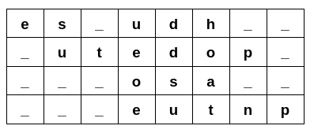
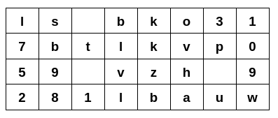

# Desafio de embaralhar a mensagem

## Primeira ideia 

O desafio consiste em criar um array multidimensional como N numeros de linhas e guardar cada caractere da mensagem em diagonal. 

Originalmente o desafio pedia para preencher os espaços entre as palavras e os espaços em branco com underscore.

Por exemplo: msg: 'eu estou estudando php', linhas: 4

Após monstar a matriz, o algoritmo iria devolver uma string contendo a mensagem embaralhada da seguinte forma: 'es_udh___utedop____osa_____eutnp'.

## Mudanças

Resolvi deixar o desafio mais interessante mudando algumas características:

- Preencher os espaços vazios com números randômicos de 0 a 9.
- Trocar cada letra pela sétima seguinte do alfabeto (cifra de César).
- O espaço entre uma palavra segue com o espaço.

Então ficou da seguinte forma:

E a mensagem retornada: 'ls bko317btlkvp059 vzh 9281lbauw'. 

## Como ficou

## Como rodar o projeto

- Clone ou baixe o projeto na tua máquina
- Execute o comando com o terminal aberto no diretório do projeto: `php -S localhost:800`

